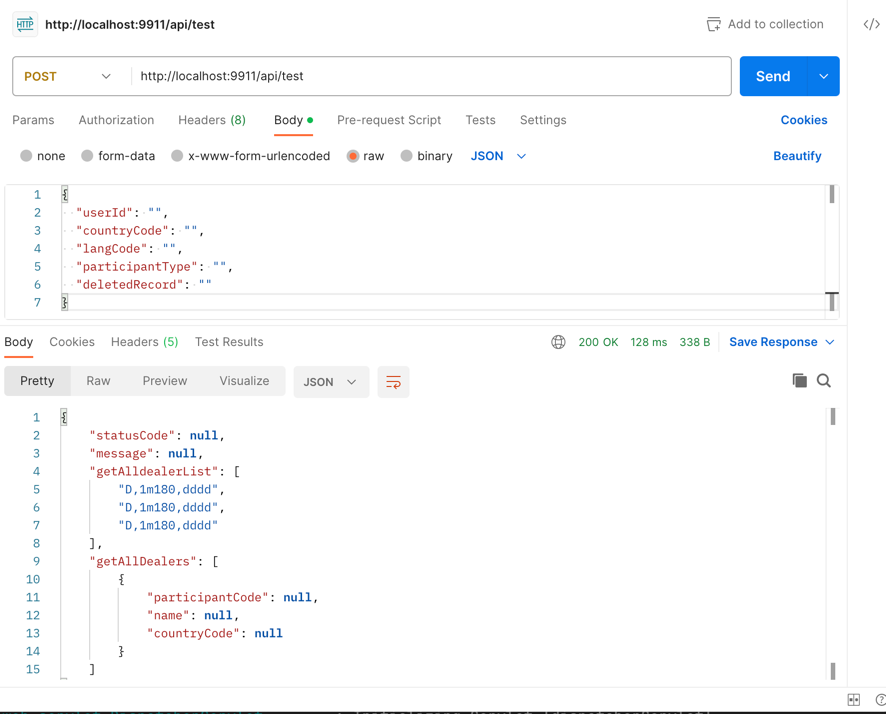

## Request
POST http://localhost:9911/api/test
```text
{
  "userId": "",
  "countryCode": "",
  "langCode": "",
  "participantType": "",
  "deletedRecord": ""
}
```

## Output

```text
{
    "statusCode": null,
    "message": null,
    "getAlldealerList": [
        "D,1m180,dddd",
        "D,1m180,dddd",
        "D,1m180,dddd"
    ],
    "getAllDealers": [
        {
            "participantCode": null,
            "name": null,
            "countryCode": null
        }
    ]
}
```


